# 🗺️ System Context & High-Level Architecture Mapping
## Component Context: Shelf Awareness Pharmaceutical SCM
**System Target**: System Defense Demo Prep, Technical Walkthrough & Architectural Blueprint

---

## 📋 Table of Contents
1. [Executive System Context](#1-executive-system-context)
2. [High-Level Architecture (C4 Model - Level 1 & 2)](#2-high-level-architecture-c4-model---level-1--2)
3. [Multi-Project Supabase Database Topology](#3-multi-project-supabase-database-topology)
4. [Microservices Registry & Port Allocations](#4-microservices-registry--port-allocations)
5. [Resilience Blueprint: Dual-Path Fallback Flow](#5-resilience-blueprint-dual-path-fallback-flow)
6. [Data Schema & Integrations](#6-data-schema--integrations)
7. [System Startup & Environment Config](#7-system-startup--environment-config)
8. [🔐 Developer Credentials & Authentication Bypass](#8--developer-credentials--authentication-bypass)
9. [🔧 Critical Production Bugs Resolved](#9--critical-production-bugs-resolved)
10. [📂 Codebase Directory Map](#10--codebase-directory-map)

---

## 1. Executive System Context
The **Pharma Distribution Management System (Shelf Awareness SCM)** is an enterprise-grade, distributed supply chain, inventory tracking, and warehouse fulfillment suite tailored for clinical and pharmaceutical operations. 

To maintain strict regulatory compliance, data isolation, and operational independence across domains, the system employs a **Domain-Driven Design (DDD)** approach implemented via:
- **Next.js Frontend Client Application** (Port `5173`)
- **NestJS Central API Gateway / Router** (Port `3001`)
- **14 Independent Express/Node.js Microservices** (Ports `4001`–`4014`)
- **5 Federated Supabase Projects** for absolute database-level boundaries

---

## 2. High-Level Architecture (C4 Model - Level 1 & 2)

The system context diagram shows the separation of user clients, microservice controllers, and cloud-hosted data domains.

```mermaid
graph TD
    %% Styling
    classDef client fill:#3b82f6,stroke:#1e3a8a,stroke-width:2px,color:#fff;
    classDef gateway fill:#8b5cf6,stroke:#4c1d95,stroke-width:2px,color:#fff;
    classDef microservice fill:#10b981,stroke:#065f46,stroke-width:2px,color:#fff;
    classDef database fill:#f59e0b,stroke:#78350f,stroke-width:2px,color:#fff;

    %% Components
    User("👤 Clinical & Supply Chain Ops (Browser)"):::client
    Frontend("💻 Next.js Frontend Application\n(Port 5173)"):::client
    Gateway("⚡ NestJS Central Gateway\n(Port 3001)"):::gateway

    subgraph "Microservices Layer (Express / Node.js)"
        MS_Supplier["📦 Supplier Service\n(Port 4001)"]:::microservice
        MS_Procure["🛒 Procurement Service\n(Port 4002)"]:::microservice
        MS_Catalog["🗂️ Product Catalog Service\n(Port 4003)"]:::microservice
        MS_Inventory["📉 Inventory Service\n(Port 4004)"]:::microservice
        MS_Warehouse["🏢 Warehouse Receiving Service\n(Port 4005)"]:::microservice
        MS_Distribution["🚚 Distribution Service\n(Port 4006)"]:::microservice
        MS_Discrepancy["⚠️ Discrepancy & QC Service\n(Port 4007)"]:::microservice
        MS_Stock["🔄 Stock Adjustment Service\n(Port 4008)"]:::microservice
        MS_Counting["🔢 Cycle Counting Service\n(Port 4009)"]:::microservice
        MS_Risk["🛡️ Risk & Compliance Service\n(Port 4010)"]:::microservice
        MS_Notification["🔔 Notification Service\n(Port 4011)"]:::microservice
        MS_Reporting["📊 Reporting & Analytics Service\n(Port 4012)"]:::microservice
        MS_Doc["📄 Document Service\n(Port 4013)"]:::microservice
        MS_Auth["🔑 Auth & User Access Service\n(Port 4014)"]:::microservice
    end

    subgraph "Multi-Project Supabase Cloud DBs"
        DB_Auth["🔐 Project 1: Identity & Profiles\n(havcomxzpyywdqtpgcgr)"]:::database
        DB_SCM["📦 Project 2: Supply Chain (SCM)\n(wbktqkjdsqrvqxxtitsg)"]:::database
        DB_Fulfill["🚚 Project 3: Fulfillment & Inventory\n(dkqvbyewfyzfmisyisgs)"]:::database
        DB_Quality["🧪 Project 4: Quality & Compliance\n(jbfzhlalkjbtbitvxeog)"]:::database
        DB_Intel["💡 Project 5: Support & Intelligence\n(gxeqtthumaujxjbnrsqd)"]:::database
    end

    %% Relations
    User -->|Accesses UI| Frontend
    Frontend -->|Aggregated / Auth Calls| Gateway
    
    %% Dual-Path Connections
    Frontend -->|Path A: Microservice REST| MS_Supplier
    Frontend -->|Path A: Microservice REST| MS_Procure
    Frontend -->|Path A: Microservice REST| MS_Catalog
    Frontend -->|Path A: Microservice REST| MS_Inventory
    Frontend -->|Path A: Microservice REST| MS_Warehouse
    Frontend -->|Path A: Microservice REST| MS_Distribution
    
    %% Database Map
    MS_Auth --> DB_Auth
    MS_Supplier --> DB_SCM
    MS_Procure --> DB_SCM
    MS_Catalog --> DB_SCM
    
    MS_Inventory --> DB_Fulfill
    MS_Warehouse --> DB_Fulfill
    MS_Distribution --> DB_Fulfill
    MS_Stock --> DB_Fulfill
    MS_Counting --> DB_Fulfill
    
    MS_Discrepancy --> DB_Quality
    MS_Risk --> DB_Quality
    
    MS_Reporting --> DB_Intel
    MS_Doc --> DB_Intel
    
    %% Path B Fallbacks (Direct client bypass)
    Frontend -.->|Path B: Direct Client SDK Fallback| DB_SCM
    Frontend -.->|Path B: Direct Client SDK Fallback| DB_Fulfill
    Frontend -.->|Path B: Direct Client SDK Fallback| DB_Quality
```



---

## 3. Multi-Project Supabase Database Topology
The backend database is split across five isolated Supabase projects. This provides complete domain segregation, specialized Row-Level Security (RLS) contexts, and prevents database-level query deadlocks.

| Database Domain | Supabase URL Ref | Core Database Tables | Key Responsibilities |
| :--- | :--- | :--- | :--- |
| **1. Identity & Auth** | `havcomxzpyywdqtpgcgr` | `profiles`, `roles`, `rbac_permissions` | Direct user registration, JWT authorization, profiles management, role mapping. |
| **2. Supply Chain (SCM)** | `wbktqkjdsqrvqxxtitsg` | `suppliers`, `purchase_orders`, `po_items`, `products` | Supplier registration, scorecards, vendor directory, master purchase ordering, catalog. |
| **3. Fulfillment** | `dkqvbyewfyzfmisyisgs` | `inventory_on_hand`, `receiving_logs`, `retail_orders`, `delivery_schedules` | Warehouse inventory tracking, receiving sorting lists, retail distribution runs, stock counts. |
| **4. Quality & Compliance** | `jbfzhlalkjbtbitvxeog` | `discrepancies`, `qc_audits`, `compliance_logs` | Clinical discrepancies reporting, defective item holds, supplier penalty validations. |
| **5. Support & Intelligence** | `gxeqtthumaujxjbnrsqd` | `analytics_aggregations`, `audit_snapshots` | Aggregated executive KPIs, dashboard history, reporting downloads. |

---

## 4. Microservices Registry & Port Allocations
Each microservice is an Express wrapper communicating directly with its dedicated tables inside the respective Supabase projects. The frontend uses a dedicated helper (`lib/<domain>Service.ts`) mapped to each microservice's local port.

| Port | Service Name | Dedicated Path in Repository | Supabase Target Project |
| :--- | :--- | :--- | :--- |
| **3001** | **`pharma-backend`** (Gateway) | `scm/scm-backend/backend` | Identity & Federated DBs |
| **4001** | **`supplier-service`** | `scm/scm-backend/services/supplier-service` | SCM DB |
| **4002** | **`procurement-service`** | `scm/scm-backend/services/procurement-service` | SCM DB |
| **4003** | **`product-catalog-service`** | `scm/scm-backend/services/product-catalog-service` | SCM DB |
| **4004** | **`inventory-service`** | `scm/scm-backend/services/inventory-service` | Fulfillment DB |
| **4005** | **`warehouse-receiving-service`** | `scm/scm-backend/services/warehouse-receiving-service` | Fulfillment DB |
| **4006** | **`distribution-service`** | `scm/scm-backend/services/distribution-service` | Fulfillment DB |
| **4007** | **`discrepancy-qc-service`** | `scm/scm-backend/services/discrepancy-qc-service` | Quality DB |
| **4008** | **`stock-adjustment-service`** | `scm/scm-backend/services/stock-adjustment-service` | Fulfillment DB |
| **4009** | **`cycle-counting-service`** | `scm/scm-backend/services/cycle-counting-service` | Fulfillment DB |
| **4010** | **`risk-compliance-service`** | `scm/scm-backend/services/risk-compliance-service` | Quality DB |
| **4011** | **`notification-service`** | `scm/scm-backend/services/notification-service` | Fulfillment/Quality DBs |
| **4012** | **`reporting-analytics-service`**| `scm/scm-backend/services/reporting-analytics-service` | Intelligence DB |
| **4013** | **`document-service`** | `scm/scm-backend/services/document-service` | Intelligence DB |
| **4014** | **`auth-user-access-service`** | `scm/scm-backend/services/auth-user-access-service` | Identity DB |

---

## 5. Resilience Blueprint: Dual-Path Fallback Flow
A critical architectural feature of this system is the **Dual-Path Resilient Fallback mechanism** embedded inside the frontend clients (`lib/*.ts`). 

Whenever a user requests data, the frontend executes a bifurcated flow:
1. **Local Toggle Verification**: Checks `localStorage.getItem("USE_REAL_SERVICES")`. If not explicitly set to `"true"`, it bypasses network microservices and performs a direct, ultra-low latency fallback to Supabase SDK.
2. **Network Connection Attempt**: If configured to use real services, the frontend attempts to call the dedicated Express microservice (e.g. `http://localhost:4001`).
3. **Graceful Fallback on Fail**: If the microservice call fails (500, network offline, socket timeout), the frontend prints an information log to the console and **gracefully switches in real-time** to communicate directly with the database tables via `supabaseSCM` or `supabaseFulfillment` clients.

```
                  [User Request Trigger]
                            │
               ✨ USE_REAL_SERVICES === 'true'?
                 /                     \
               No                       Yes
               /                         \
              ▼                           ▼
    [Direct Supabase Path]       [Attempt Express Service]
    (Bypass Node microservice)   (Call e.g. http://localhost:4001)
              │                           │
              │                 ✅ Succeeds?  ───► [Return Data]
              │                  /         \
              │                Yes          No (Offline or Error)
              │                /             \
              ▼               ▼               ▼
        [Return Data]   [Return Data]  ⚠️ [Graceful Fallback Path]
                                       (Consoles info log & runs
                                        direct Supabase query)
                                              │
                                              ▼
                                        [Return Data]
```

---

## 6. Data Schema & Integrations

### Inbound vs. Outbound Logistics Flow
The business operations logic binds these microservices and databases in a sequential chain:

```
[Supplier Service (4001)] ──► Adds Vendor details to Supply Chain DB
          │
          ▼
[Procurement Service (4002)] ──► Spawns Purchase Order (PO) in SCM DB
          │
          ▼
[Warehouse Receiving (4005)] ──► Confirms PO items, flags discrepancies (4007), 
          │                      and commits stock to Fulfillment DB
          ▼
[Inventory Service (4004)] ──► Recalculates total stock value and valuation metrics
          │
          ▼
[Distribution Service (4006)] ──► Ships stock outward to retail clinics and tracks fulfillment
```

### Database Reference Mappings
- `public.products` in **SCM Database**: Configures names, classifications (Pharma, Medical Supplies, Cold Chain), unit pricing, and storage locations.
- `public.inventory_on_hand` in **Fulfillment Database**: Maintains current physical inventory quantities mapped to SKU identifiers.

---

## 7. System Startup & Environment Config

### Unified Launch Orchestration
Startup is coordinated from the project root via standard scripts:
- **`npm run dev`**: Spawns `node scripts/dev-stack.mjs`, which launches all 14 Express microservices, the NestJS gateway, and the Next.js frontend concurrently, assigning stdout colors to prefix logs for ease of reading.
- **Port Checking**: Before initiating, all previous Node processes must be cleared from the system stack to avoid binding conflict issues (`EADDRINUSE`).

### Global Env Sync
Every service loads environments from their own directory-level `.env` file, which maps variables like:
```ini
NEXT_PUBLIC_SUPABASE_URL=https://havcomxzpyywdqtpgcgr.supabase.co
NEXT_PUBLIC_SUPABASE_SUPPLY_CHAIN_URL=https://wbktqkjdsqrvqxxtitsg.supabase.co
NEXT_PUBLIC_SUPABASE_FULFILLMENT_URL=https://dkqvbyewfyzfmisyisgs.supabase.co
NEXT_PUBLIC_SUPABASE_QUALITY_URL=https://jbfzhlalkjbtbitvxeog.supabase.co
NEXT_PUBLIC_SUPABASE_SUPPORT_INTEL_URL=https://gxeqtthumaujxjbnrsqd.supabase.co
```
This ensures complete system alignment when transitioning from offline mode to a live federated deployment.

---

## 8. 🔐 Developer Credentials & Authentication Bypass
For rapid system validation and development, the portal has built-in bypass credentials:
* **Email:** `admin@shelfawareness.com`
* **Password:** `password123`
* **Zustand Role Mapping:** Granting comprehensive permissions across all dashboard tabs (**Procurement**, **Operations**, **Executive**).

---

## 9. 🔧 Critical Production Bugs Resolved
To assist any developer or AI investigating the stability of the SCM codebase, the following major issues have been successfully hotpatched and fully resolved:

### 1. Corrupted Scorecard cache (500 Error in Supplier Analytics)
* **Location:** `scm/scm-backend/services/supplier-service/.cache/supplier-scorecards.json`
* **Symptoms:** The **Supplier On-Time %** KPI card was hidden on the frontend, and the **Supplier Reliability Scorecard** interactive donut chart was rendering an empty state because the backend `/supplier-scorecards` endpoint was throwing a `500 Internal Server Error`.
* **Root Cause:** A malformed syntax sequence at the end of the JSON cache file (`}} \n }`) caused `JSON.parse` to crash during microservice startup.
* **Resolution:** Cleared out the malformed closing curly braces to establish strict JSON syntax. The microservice restored successfully, displaying the 0.0% metrics and drawing the charts.

### 2. Failure to Schedule Warehouse Deliveries (PostgREST Schema Mismatch)
* **Location:** `scm/scm-backend/services/warehouse-receiving-service/src/lib/supabaseRest.js`
* **Symptoms:** `POST http://localhost:4005/delivery-schedules` returned `500 Internal Server Error` with `NOT_FOUND` / `Requested function was not found`.
* **Root Causes:**
  1. The code attempted to make a POST to a non-existent Supabase Edge Function: `${env.fulfillmentSupabaseUrl}/functions/v1/shipments`.
  2. The online database table `delivery_schedules` has a more restricted schema compared to the local migration file (`delivery_schedules_schema.sql`). The online table only contains `id`, `delivery_datetime`, `supplier_name`, `expected_items_count`, `warehouse_location`, and `status`. It is missing `contact_person_name`, `contact_phone`, and `notes`. Calling the REST endpoint with these extra fields returned a PostgREST error.
  3. The `id` primary key field is defined as `TEXT PRIMARY KEY` but has no Postgres default generator, meaning inserts fail if a unique ID is not manually passed.
* **Resolution:** 
  1. Refined `scheduleDeliveryRest` to POST directly to the PostgREST endpoint `/rest/v1/delivery_schedules`.
  2. Introduced `crypto.randomUUID()` to generate a unique ID on the server.
  3. Destructured the payload to filter out non-existent fields (`contact_person_name`, `contact_phone`, `notes`) and only submit the actual valid columns to PostgREST.

---

## 10. 📂 Codebase Directory Map
Here is a directory map of the most important files across frontend and backend modules:

```
├── scm
│   ├── scm-frontend
│   │   ├── components
│   │   │   ├── screens
│   │   │   │   ├── LoginScreen.tsx          # Dev bypass portal handler
│   │   │   │   └── WarehouseReceiving.tsx   # Warehouse receiving UI & scheduling triggers
│   │   │   └── dashboard
│   │   │       ├── KPIScorecardBar.tsx      # Procurement/Operations KPI render
│   │   │       └── procurement
│   │   │           └── SupplierReliabilityScorecard.tsx # Donut chart visualizer
│   │   └── lib
│   │       ├── warehouseReceivingService.ts # Client API helper communicating with port 4005
│   │       └── supabase.ts                  # Supabase federated SDK initialization
│   │
│   └── scm-backend
│       ├── backend                          # Central NestJS gateway router
│       └── services
│           ├── supplier-service             # Port 4001, handles vendor directories & local scorecard cache
│           └── warehouse-receiving-service  # Port 4005, processes GRN drafts & schedules warehouse deliveries
│
├── scripts
│   └── dev-stack.mjs                        # Startup launch orchestrator script
├── SystemContext.md                         # This file (Architectural System Context)
└── delivery_schedules_schema.sql            # Local PostgreSQL migration reference schema
```
